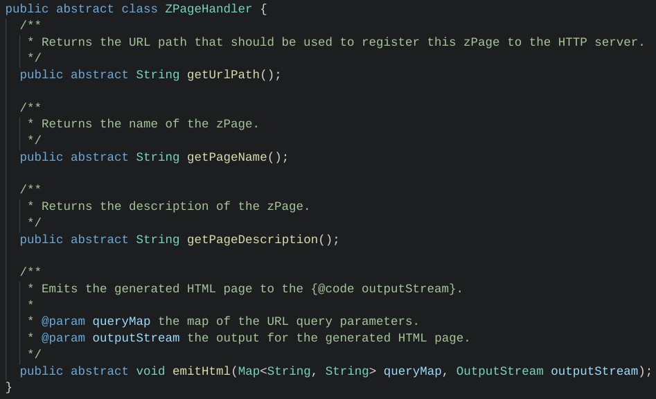
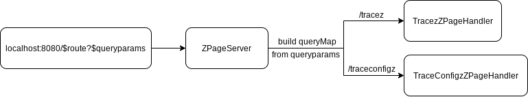
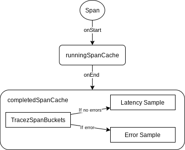
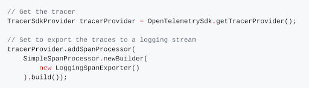

# OpenTelemetry SDK Contrib - /tracez and /traceconfigz Design Doc

This file contains information about the design choices for the OpenTelemetry /tracez and
/traceconfigz zPages.

## Introduction

The OpenTelemetry zPages are a set of dynamically generated HTML pages that display trace and
metrics data for a running process: the /tracez zPage displays trace information about running
spans, sample span latencies, and sample error spans, while the /traceconfigz zPage is a web page
that allows the users to change tracing parameters, such as sampling probability and max number of
attributes.

### /tracez zPage

The /tracez zPage displays information on running spans, sample span latencies, and sample error
spans. The data is aggregated into a summary-level table:

You can click on each of the counts in the table cells to access the corresponding span
details. For example, here are the details of the `ChildSpan` latency sample (row 1, col 4):

### /traceconfigz zPage

The /traceconfigz zPage displays information about the currently active tracing configuration and
provides an interface for users to modify relevant parameters:

## Motivation

We are building the Java zPages in order to create a lightweight application performance monitoring
tool that allows users to troubleshoot OpenTelemetry instrumentation.

## Design

### Frontend

#### HttpHandler

The `HttpHandler` is responsible for rendering corresponding HTML content. An abstract base class,
`ZPageHandler` (OpenCensus implementation), is implemented to standardize handlers for different
zPages. Each page will implement their own `ZPageHandler`, extending the base class, to generate the
corresponding HTML content for that page.

##### TraceZ Handler

For the `TracezZPageHandler` class, the span data from `TracezDataAggregator` will be passed in when
an instance of the class is created. It will later be used to retrieve span information and display
the data in a table.

##### TraceConfigZ Handler

For the `TraceConfigzZPageHandler` class, the `TraceConfig` class will be used to change sampling
rate and tracing parameters.

#### HttpServer
The `HttpServer` is responsible for listening to incoming requests, obtaining requested data, and
rendering corresponding HTML content. The `HttpServer` class from `com.sun.net` will be used to
handle http requests and responses on different routes (users need to ensure that they are using a
version of JDK that includes the `HttpServer` class; this requirement will be added to the README).
Once a request is received by the `HttpServer`, it will invoke the handle function which in turn
invokes the `emitHtml` function to render the HTML content.

The `HttpServer` class utilizes `com.sun.net.httpserver` to create servers. Users need to ensure
that they are using a version of JDK that comes with the package.

##### Handling Requests

### Backend

#### Overview

The proposed structure is encompassed by the following diagram:

Spans, which are the units of tracing, are monitored by a `SpanProcessor`. The `SpanProcessor` is
exposed to a `DataAggregator`, which can retrieve information about the spans through API calls.
Lastly, the frontend calls functions in the `DataAggregator` to obtain information needed for the
web page.

#### SpanProcessor

A `SpanProcessor` watches the lifecycle of each span, and its functions are called every time a span
starts or ends. For the /tracez zPage, I have implemented a `TracezSpanProcessor`, which will
maintain two data structures: a running span cache and a completed span cache.

##### Visual Diagram

Below is a visual diagram of the `TracezSpanProcessor` class:

When a span starts, it is first added to the `runningSpanCache`. Once that span ends, it is removed
from the `runningSpanCache` and added to the `completedSpanCache` as either a latency sample if
there are no errors or an error sample if there are.

##### Initial Design

At first, we planned to have both the running span and completed span caches map span IDs to spans.
The problem with this setup was that the number of completed spans would grow without bound. Note
that the number of running spans is naturally limited by the SDK, so the size of the running span
cache will never grow too large at any given time. However, the same cannot be said of the completed
span cache. In order to limit the number of completed spans, we had to consider an alternative data
structure that could impose the necessary limits.

##### Proposed Design

To constrain the number of completed spans, we built a new class called `TracezSpanBuckets` and
reworked the completed span cache to map span names to `TracezSpanBuckets` instances. The
`TracezSpanBuckets` class uses FIFO evicting queues to limit the number of latency samples per
bucket to 16 and the number of error samples per bucket to 8. With a hard limit, this setup ensures
that the completed span cache does not grow too large too quickly. For reference, OpenCensus
restricted the number of latency samples per bucket to 10 and the number of error samples per bucket
to 5.

#### DataAggregator

The `DataAggregator` restructures the data from the `SpanProcessor` into an accessible format for
the frontend to display. For this, I have implemented a class called `TracezDataAggregator`. This
class is constructed with a `TracezSpanProcessor` instance, so that the `TracezDataAggregator` class
can access the spans collected by a specific `TracezSpanProcessor`.

##### Proposed Design

The `TracezDataAggregator`'s purpose is to simplify the frontend's job of displaying information.
Consequently, the class supports functions for retrieving spans names, span counts, along with the
spans themselves. The frontend can then directly use the data collections that are returned.

##### Accessing the TracezSpanProcessor

When a user instruments their code, they first create a `SpanProcessor` and then add that instance
to a `TracerSdkProvider` with `addSpanProcessor`. An example from the official quickstart docs is
shown below:

While implementing the `TracezDataAggregator`, we faced the issue of how the backend was supposed to
access a `TracezSpanProcessor` created by the user. At the moment, there is no way for developers to
access the span processor instances that are added to the `TracerSdkProvider`. Consequently, we
propose that the `HttpServer` class add the `TracezSpanProcessor` itself, rather than requiring the
user to create and add the instance. This can be done by replicating the code in the above example:
use the `getTracerProvider` function in the `OpenTelemetrySdk` class and then call addProcessor with
the returned object. Note that `getTracerProvider` in the `OpenTelemetrySdk` class calls
`getTracerProvider` in the `OpenTelemetry` class, which returns a Singleton instance. This means
that the `OpenTelemetrySdk` class should return a Singleton instance as well, so the backend will
get the same `TracerSdkProvider` that the user uses.

#### TraceConfigZ

The final component of this project is the /traceconfigz zPage, which allows the user to update the
config for the /tracez zPage in real-time. In OpenTelemetry, updates are already handled by the
TraceSdkProvider class, so we only needed to wire them up and write the corresponding HTML. Since
most of the infrastructure was already built, there was no real design aspect to this.

### Sequence Diagram

Below is a sequence diagram of how the frontend and backend components will communicate:

