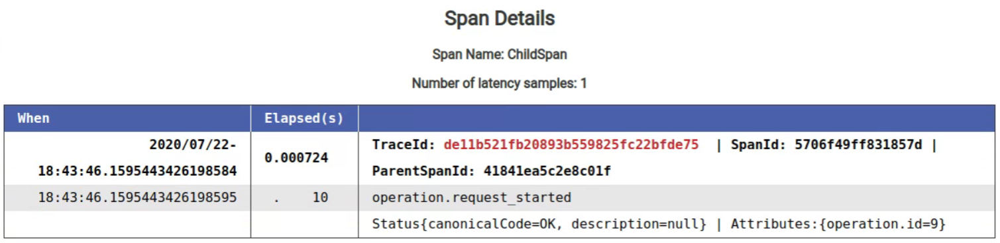
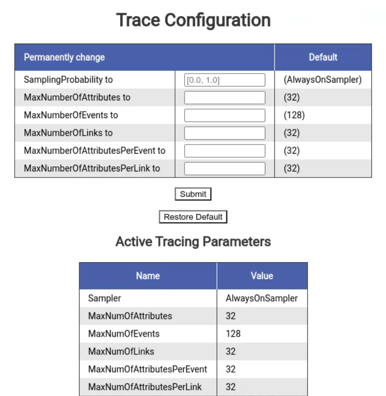

# OpenTelemetry Incubator

This artifact contains experimental code related to the trace and metric SDKs.

## View File Configuration

Adds support for file based YAML configuration of Metric SDK Views.

For example, suppose `/Users/user123/view.yaml` has the following content:

```yaml
- selector:
    instrument_name: my-instrument
    instrument_type: COUNTER
    instrument_unit: ms
    meter_name: my-meter
    meter_version: 1.0.0
    meter_schema_url: http://example.com
  view:
    name: new-instrument-name
    description: new-description
    aggregation: explicit_bucket_histogram
    aggregation_args:
      bucket_boundaries: [1.0, 2.0, 5.0]
    attribute_keys:
      - foo
      - bar
```

The equivalent view configuration would be:

```
SdkMeterProvider.builder()
   .registerView(
       InstrumentSelector.builder()
           .setName("my-instrument")
           .setType(InstrumentType.COUNTER)
           .setUnit("ms")
           .setMeterName("my-meter")
           .setMeterVersion("1.0.0")
           .setMeterSchemaUrl("http://example.com")
           .build(),
       View.builder()
           .setName("new-instrument")
           .setDescription("new-description")
           .setAggregation(Aggregation.explicitBucketHistogram(Arrays.asList(1.0, 2.0, 5.0))
           .setAttributesFilter(key -> new HashSet<>(Arrays.asList("foo", "bar")).contains(key))
           .build());
```

If using [autoconfigure](../autoconfigure) with this artifact on your classpath, it will automatically load a list of view config files specified via environment variable or system property:

| System property                       | Environment variable                  | Purpose                                              |
|---------------------------------------|---------------------------------------|------------------------------------------------------|
| otel.experimental.metrics.view-config | OTEL_EXPERIMENTAL_METRICS_VIEW_CONFIG | List of files containing view configuration YAML [1] |

**[1]** In addition to absolute paths, resources on the classpath packaged with a jar can be loaded.
For example, `otel.experimental.metrics.view-config=classpath:/my-view.yaml` loads the
resource `/my-view.yaml`.

If not using autoconfigure, a file can be used to configure views as follows:

```
SdkMeterProviderBuilder builder = SdkMeterProvider.builder();
try (FileInputStream fileInputStream = new FileInputStream("/Users/user123/view.yaml")) {
  ViewConfig.registerViews(builder, fileInputStream);
}
```

The following table describes the set of recognized aggregations:

| Aggregation                      | Arguments                                                                                                                      |
|----------------------------------|--------------------------------------------------------------------------------------------------------------------------------|
| [`default`]                      | -                                                                                                                              |
| [`sum`]                          | -                                                                                                                              |
| [`last_value`]                   | -                                                                                                                              |
| [`drop`]                         | -                                                                                                                              |
| [`explicit_bucket_histogram`]    | `bucket_boundaries` (optional): List of inclusive upper boundaries for the histogram buckets, in order from lowest to highest. |
| [`exponential_bucket_histogram`] | `max_buckets` (optional): The maximum number of buckets to use for positive or negative recordings.                            |

Additional notes on usage:

- Many view configurations can live in one file. The YAML is parsed as an array of view
  configurations.
- At least one selection field is required, but including all is not necessary. Any omitted fields
  will result in the default from `InstrumentSelector` being used.
- At least one view field is required, but including all is not required. Any omitted fields will
  result in the default from `View` being used.
- Instrument name selection supports the following wildcard characters: `*` matches 0 or more instances of any character; `?` matches exactly one instance of any character. No other advanced selection criteria is supported.

[`default`]: https://github.com/open-telemetry/opentelemetry-specification/blob/main/specification/metrics/sdk.md#default-aggregation
[`sum`]: https://github.com/open-telemetry/opentelemetry-specification/blob/main/specification/metrics/sdk.md#sum-aggregation
[`last_value`]: https://github.com/open-telemetry/opentelemetry-specification/blob/main/specification/metrics/sdk.md#last-value-aggregation
[`drop`]: https://github.com/open-telemetry/opentelemetry-specification/blob/main/specification/metrics/sdk.md#drop-aggregation
[`explicit_bucket_histogram`]: https://github.com/open-telemetry/opentelemetry-specification/blob/main/specification/metrics/sdk.md#explicit-bucket-histogram-aggregation
[`exponential_bucket_histogram`]: https://github.com/open-telemetry/opentelemetry-specification/blob/main/specification/metrics/sdk.md#exponential-bucket-histogram-aggregation

## zPages

OpenTelemetry Java zPages are a collection of dynamic HTML web pages embedded in your app that
display stats and trace data. Learn more
in [this blog post](https://medium.com/opentelemetry/zpages-in-opentelemetry-2b080a81eb47).

### Register the zPages

**Note:** The package `com.sun.net.httpserver` is required to use the default zPages setup. Please
make sure your
version of the JDK includes this package.

To setup the zPages, register zPages with your `OpenTelemetrySdk` and
call `startHttpServerAndRegisterAllPages(int port)` on your ZPageServer instance:

```java
public class MyMainClass {
  public static void main(String[] args) throws Exception {
    // Create a new ZPageServer
    ZPageServer zpageServer = ZPageServer.create();
    // Configure OpenTelemetrySdk with zPages
    OpenTelemetry openTelemetry =
        OpenTelemetrySdk.builder().setTracerProvider(zpageServer.buildSdkTracerProvider()).build();

    // Start zPages server
    zpageServer.startHttpServerAndRegisterAllPages(8080);
    // ...Do work (this is just an example)
    long count = 0;
    while (true) {
      Tracer tracer = openTelemetry.getTracer("demo");
      Span span = tracer.spanBuilder("exampleSpan" + ++count).startSpan();
      try (Scope scope = span.makeCurrent()) {
        System.out.println("Inside a span...");
        TimeUnit.SECONDS.sleep(2);
      }
      span.end();
    }
  }
}
```

Note that `startHttpServerAndRegisterAllPages()` will create a new `HttpServer` and register the zPages
with it. If you already have an existing or shared `HttpServer`, you can instead call
`registerAllPagesToHttpServer(HttpServer server)`:

```java
public class MyMainClass {
  public static void main(String[] args) throws Exception {
    // ...configure OpenTelemetrySdk with zPages

    // Start zPages server
    HttpServer server = HttpServer.create(new InetSocketAddress(8000), 10);
    zPageServer.registerAllPagesToHttpServer(server);
    server.start();
    // ... do work
  }
}
```

### Access the zPages

#### View all available zPages on the `/` index page

The index page `/` lists all available zPages with a link and description.

#### View trace spans on the `/tracez` zPage

The /tracez zPage displays information on running spans, sample span latencies, and sample error
spans. The data is aggregated into a summary-level table:


You can click on each of the counts in the table cells to access the corresponding span
details. For example, here are the details of the `ChildSpan` latency sample (row 1, col 4):



#### View and update the tracing configuration on the `/traceconfigz` zPage

The /traceconfigz zPage displays information about the currently active tracing configuration and
provides an interface for users to modify relevant parameters. Here is what the web page looks like:


