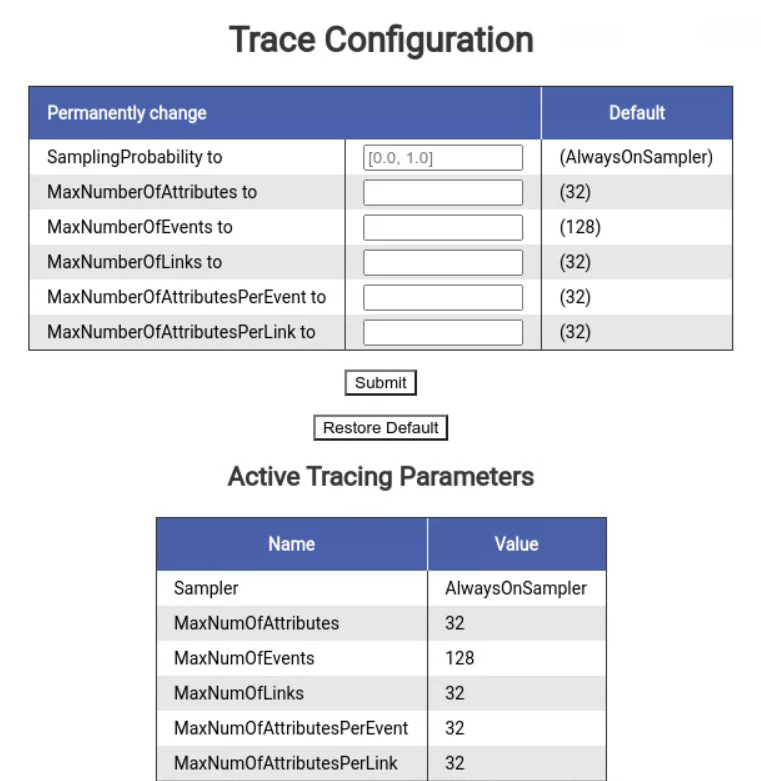

# OpenTelemetry Tracing Incubator

## zPages

OpenTelemetry Java zPages are a collection of dynamic HTML web pages embedded in your app that
display stats and trace data. Learn more
in [this blog post](https://medium.com/opentelemetry/zpages-in-opentelemetry-2b080a81eb47).

### Register the zPages

**Note:** The package `com.sun.net.httpserver` is required to use the default zPages setup. Please
make sure your
version of the JDK includes this package.

To setup the zPages, register zPages with your `OpenTelemetrySdk` and
call `ZPageServer.startHttpServerAndRegisterAllPages(int port)`:

```java
public class MyMainClass {
  public static void main(String[] args) throws Exception {
    // Configure OpenTelemetrySdk with zPages
    OpenTelemetry openTelemetry = OpenTelemetrySdk.builder()
        .setTracerProvider(
            SdkTracerProvider.builder()
                .addSpanProcessor(ZPageServer.getSpanProcessor())
                .setSpanLimits(ZPageServer.getTracezTraceConfigSupplier())
                .setSampler(ZPageServer.getTracezSampler())
                .build())
        .build();

    // Start zPages server
    ZPageServer.startHttpServerAndRegisterAllPages(8080);
    // ... do work
  }
}
```

Alternatively, you can call `ZPageServer.registerAllPagesToHttpServer(HttpServer server)` to
register the zPages to a shared server:

```java
public class MyMainClass {
  public static void main(String[] args) throws Exception {
    // ...configure OpenTelemetrySdk with zPages

    // Start zPages server
    HttpServer server = HttpServer.create(new InetSocketAddress(8000), 10);
    ZPageServer.registerAllPagesToHttpServer(server);
    server.start();
    // ... do work
  }
}
```

### Access the zPages

#### View all available zPages on the `/` index page

The index page `/` lists all available zPages with a link and description.

#### View trace spans on the `/tracez` zPage

The /tracez zPage displays information on running spans, sample span latencies, and sample error
spans. The data is aggregated into a summary-level table:


You can click on each of the counts in the table cells to access the corresponding span
details. For example, here are the details of the `ChildSpan` latency sample (row 1, col 4):


#### View and update the tracing configuration on the `/traceconfigz` zPage

The /traceconfigz zPage displays information about the currently active tracing configuration and
provides an interface for users to modify relevant parameters. Here is what the web page looks like:



### Benchmark Testing

This module contains two sets of benchmark tests: one for adding spans to an instance of
TracezSpanBuckets and another for retrieving counts and spans with TracezDataAggregator. You can run
the tests yourself with the following commands:

```
./gradlew -PjmhIncludeSingleClass=TracezSpanBucketsBenchmark clean :opentelemetry-sdk-extension-zpages:jmh
./gradlew -PjmhIncludeSingleClass=TracezDataAggregatorBenchmark clean :opentelemetry-sdk-extension-zpages:jmh
```

[![Javadocs][javadoc-image]][javadoc-url]

[javadoc-image]: https://www.javadoc.io/badge/io.opentelemetry/opentelemetry-sdk-extension-tracing-incubator.svg
[javadoc-url]: https://www.javadoc.io/doc/io.opentelemetry/opentelemetry-sdk-extension-tracing-incubator
