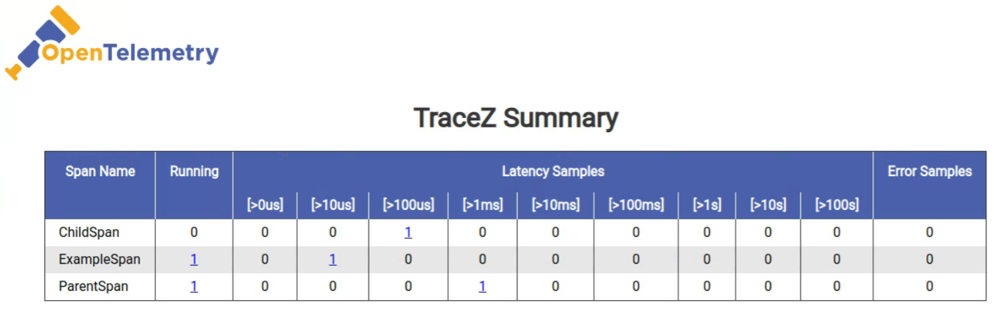

# OpenTelemetry SDK Extension zPages

[![Javadocs][javadoc-image]][javadoc-url]

This module contains code for OpenTelemetry Java zPages, which are a collection of dynamic HTML
web pages that display stats and trace data.

* Java 7 compatible.

<!--- TODO: Update javadoc -->
[javadoc-image]: https://www.javadoc.io/badge/io.opentelemetry/opentelemetry-sdk-contrib-auto-config.svg
[javadoc-url]: https://www.javadoc.io/doc/io.opentelemetry/opentelemetry-sdk-contrib-auto-config

## Quickstart

### Add the dependencies to your project

For Maven, add the following to your `pom.xml`:
```xml
<dependencies>
  <dependency>
        <groupId>io.opentelemetry</groupId>
        <artifactId>opentelemetry-api</artifactId>
        <version>0.7.0</version>
      </dependency>
      <dependency>
        <groupId>io.opentelemetry</groupId>
        <artifactId>opentelemetry-sdk</artifactId>
        <version>0.7.0</version>
      </dependency>
      <dependency>
        <groupId>io.opentelemetry</groupId>
        <artifactId>opentelemetry-sdk-extension-zpages</artifactId>
        <version>0.7.0</version>
      </dependency>
</dependencies>
```

<!--- TODO: Verify gradle configuration -->
For Gradle, add the following to your dependencies:
```groovy
implementation 'io.opentelemetry:opentelemetry-api:0.7.0'
implementation 'io.opentelemetry:opentelemetry-sdk:0.7.0'
implementation 'io.opentelemetry:opentelemetry-sdk-extension-zpages:0.7.0'
```

### Register the zPages

**Note:** The package `com.sun.net.httpserver` is required to use the default zPages setup. Please make sure your
version of the JDK includes this package.

To set-up the zPages, simply call `ZPageServer.startHttpServerAndRegisterAllPages(int port)` in your
main function:

```java
public class MyMainClass {
  public static void main(String[] args) throws Exception {
    ZPageServer.startHttpServerAndRegisterAllPages(8080);
    // ... do work
  }
}
```

Alternatively, you can call `ZPageServer.registerAllPagesToHttpServer(HttpServer server)` to
register the zPages to a shared server:

```java
public class MyMainClass {
  public static void main(String[] args) throws Exception {
    HttpServer server = HttpServer.create(new InetSocketAddress(8000), 10);
    ZPageServer.registerAllPagesToHttpServer(server);
    server.start();
    // ... do work
  }
}
```

### Access the zPages

#### View all available zPages on the `/` index page

The index page `/` lists all available zPages with a link and description.

#### View trace spans on the `/tracez` zPage

The /tracez zPage displays information on running spans, sample span latencies, and sample error
spans. The data is aggregated into a summary-level table:



You can click on each of the counts in the table cells to access the corresponding span
details. For example, here are the details of the `ChildSpan` latency sample (row 1, col 4):


#### View and update the tracing configuration on the `/traceconfigz` zPage

The /traceconfigz zPage displays information about the currently active tracing configuration and 
provides an interface for users to modify relevant parameters. Here is what the web page looks like:


## Benchmark Testing

This module contains a set of benchmark tests for adding spans to an instance of TracezSpanBuckets.
You can run the tests yourself with the following command:

```
./gradlew -PjmhIncludeSingleClass=TracezSpanBucketsBenchmark clean :opentelemetry-sdk-extension-zpages:jmh
```

Below is a summary of the expected results:

```
Benchmark                                                                       Mode  Cnt      Score     Error   Units

TracezSpanBucketsBenchmark.addToBucket_01Thread                                thrpt   10  17133.815 ± 179.117  ops/ms
TracezSpanBucketsBenchmark.addToBucket_01Thread:·gc.alloc.rate                 thrpt   10    609.617 ±   6.356  MB/sec
TracezSpanBucketsBenchmark.addToBucket_01Thread:·gc.alloc.rate.norm            thrpt   10     56.000 ±   0.001    B/op
TracezSpanBucketsBenchmark.addToBucket_01Thread:·gc.churn.G1_Eden_Space        thrpt   10    630.842 ± 502.667  MB/sec
TracezSpanBucketsBenchmark.addToBucket_01Thread:·gc.churn.G1_Eden_Space.norm   thrpt   10     57.967 ±  46.195    B/op
TracezSpanBucketsBenchmark.addToBucket_01Thread:·gc.count                      thrpt   10      8.000            counts
TracezSpanBucketsBenchmark.addToBucket_01Thread:·gc.time                       thrpt   10     37.000                ms

TracezSpanBucketsBenchmark.addToBucket_05Threads                               thrpt   10   1448.734 ±  59.915  ops/ms
TracezSpanBucketsBenchmark.addToBucket_05Threads:·gc.alloc.rate                thrpt   10     88.369 ±   3.629  MB/sec
TracezSpanBucketsBenchmark.addToBucket_05Threads:·gc.alloc.rate.norm           thrpt   10     96.002 ±   0.001    B/op
TracezSpanBucketsBenchmark.addToBucket_05Threads:·gc.churn.G1_Eden_Space       thrpt   10     78.812 ± 376.794  MB/sec
TracezSpanBucketsBenchmark.addToBucket_05Threads:·gc.churn.G1_Eden_Space.norm  thrpt   10     85.257 ± 407.608    B/op
TracezSpanBucketsBenchmark.addToBucket_05Threads:·gc.count                     thrpt   10      1.000            counts
TracezSpanBucketsBenchmark.addToBucket_05Threads:·gc.time                      thrpt   10      6.000                ms

TracezSpanBucketsBenchmark.addToBucket_10Threads                               thrpt   10   2435.441 ±  49.773  ops/ms
TracezSpanBucketsBenchmark.addToBucket_10Threads:·gc.alloc.rate                thrpt   10    148.482 ±   3.023  MB/sec
TracezSpanBucketsBenchmark.addToBucket_10Threads:·gc.alloc.rate.norm           thrpt   10     96.002 ±   0.001    B/op
TracezSpanBucketsBenchmark.addToBucket_10Threads:·gc.churn.G1_Eden_Space       thrpt   10    157.433 ± 501.783  MB/sec
TracezSpanBucketsBenchmark.addToBucket_10Threads:·gc.churn.G1_Eden_Space.norm  thrpt   10    102.915 ± 328.063    B/op
TracezSpanBucketsBenchmark.addToBucket_10Threads:·gc.count                     thrpt   10      2.000            counts
TracezSpanBucketsBenchmark.addToBucket_10Threads:·gc.time                      thrpt   10     12.000                ms

TracezSpanBucketsBenchmark.addToBucket_20Threads                               thrpt   10   2355.800 ± 140.500  ops/ms
TracezSpanBucketsBenchmark.addToBucket_20Threads:·gc.alloc.rate                thrpt   10    143.503 ±   8.528  MB/sec
TracezSpanBucketsBenchmark.addToBucket_20Threads:·gc.alloc.rate.norm           thrpt   10     96.004 ±   0.001    B/op
TracezSpanBucketsBenchmark.addToBucket_20Threads:·gc.churn.G1_Eden_Space       thrpt   10    157.130 ± 500.816  MB/sec
TracezSpanBucketsBenchmark.addToBucket_20Threads:·gc.churn.G1_Eden_Space.norm  thrpt   10    106.904 ± 340.741    B/op
TracezSpanBucketsBenchmark.addToBucket_20Threads:·gc.count                     thrpt   10      2.000            counts
TracezSpanBucketsBenchmark.addToBucket_20Threads:·gc.time                      thrpt   10     10.000                ms
```
